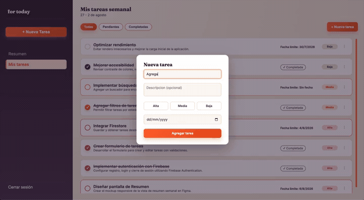
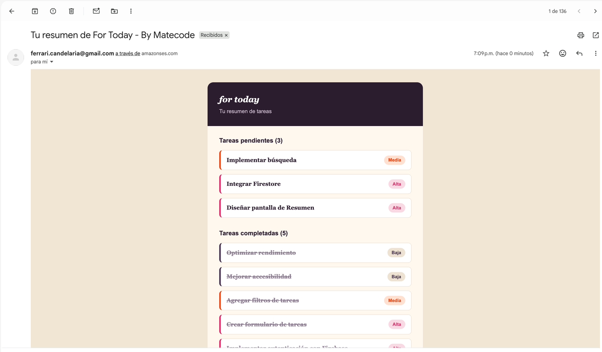
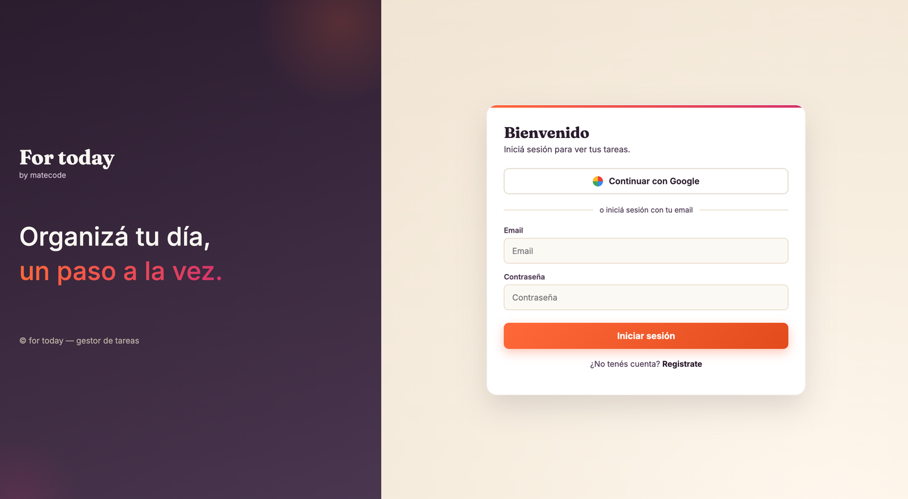
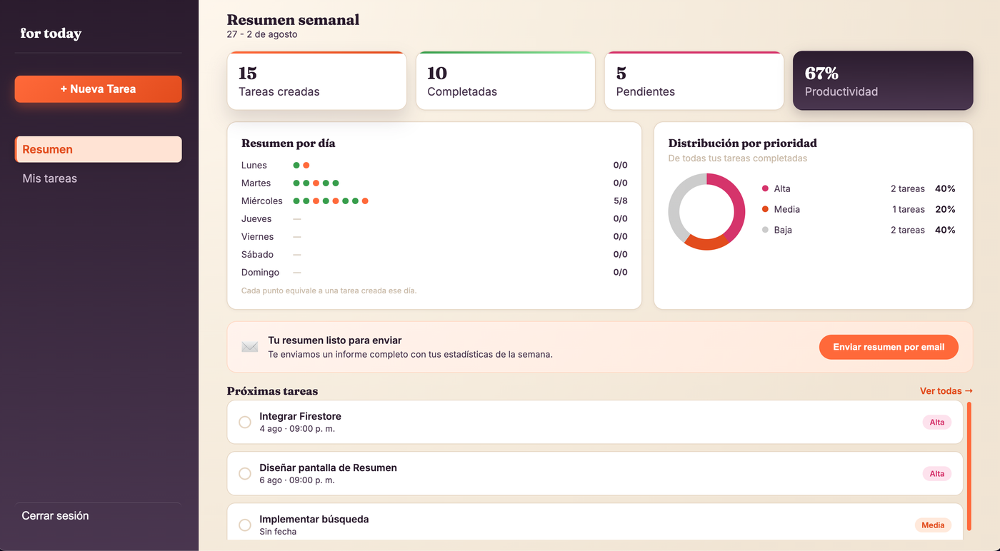
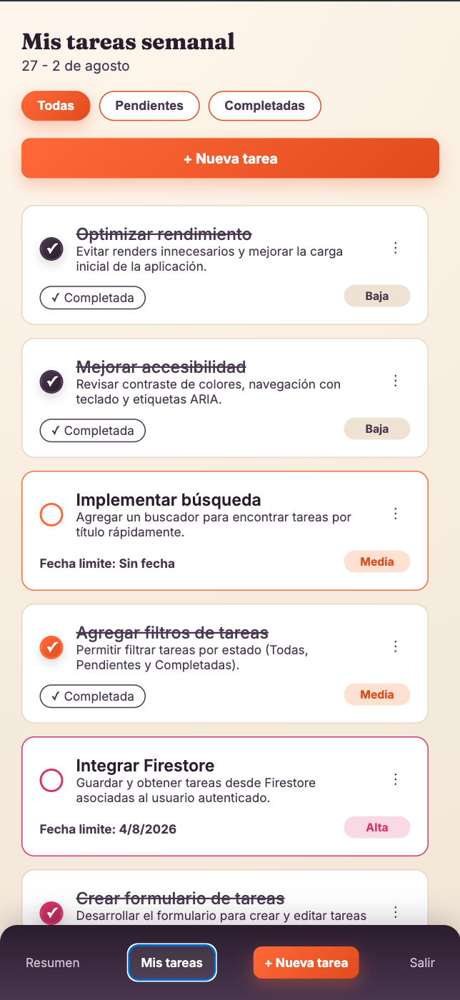
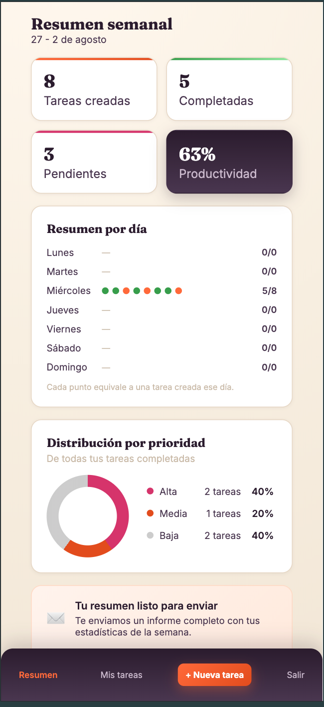

# For Today

Gestor de tareas semanal (SPA) hecho con React + TypeScript, con autenticación y persistencia por usuario en Firebase, envío de un resumen de tareas por email vía AWS SES, y deploy en Vercel.

Proyecto Integrador 4 — Soy Henry.

**Producción:** https://proyecto-m4-candelaria-ferrari.vercel.app/



## Índice

- [Funcionalidades](#funcionalidades)
- [Stack](#stack)
- [Arquitectura y decisiones técnicas](#arquitectura-y-decisiones-técnicas)
- [Estructura de carpetas](#estructura-de-carpetas)
- [Instalación](#instalación)
- [Variables de entorno](#variables-de-entorno)
- [Scripts disponibles](#scripts-disponibles)
- [Testing](#testing)
- [Flujo de envío de emails](#flujo-de-envío-de-emails)
- [Reglas de seguridad de Firestore](#reglas-de-seguridad-de-firestore)
- [Capturas](#capturas)
- [Uso de IA](#uso-de-ia)

## Funcionalidades

- Registro, login y logout con Firebase Authentication. Rutas privadas protegidas (`/tasks`, `/summary`), sesión persistente al recargar.
- CRUD completo de tareas (crear, editar, eliminar, marcar como completada), persistido en Firestore y filtrado por usuario.
- La lista se actualiza sola después de cada operación, sin recargar la página (suscripción en tiempo real con `onSnapshot`).
- Filtros por estado (todas / pendientes / completadas), prioridad y fecha límite por tarea.
- Envío de un resumen de tareas por email (texto plano + versión con diseño en HTML) mediante una función serverless en Vercel que usa AWS SES.
- Diseño responsive mobile-first.
- Tests unitarios y de componentes con Vitest + React Testing Library.

## Stack

- **Frontend:** React 19 + TypeScript, Vite, React Router.
- **Backend as a Service:** Firebase (Authentication + Firestore).
- **Email:** AWS SES, invocado desde una función serverless de Vercel (`api/send-email.ts`), nunca directamente desde el navegador.
- **Testing:** Vitest + React Testing Library + jsdom.
- **Deploy:** Vercel.

## Arquitectura y decisiones técnicas

- **`onSnapshot` en vez de `getDocs`:** se eligió una suscripción en tiempo real para leer las tareas del usuario. Además de actualizar la UI automáticamente después de cada operación CRUD (sin re-fetchear a mano), permite reutilizar el mismo hook (`useTasks`) en cualquier pantalla que necesite la misma información sin duplicar lógica de sincronización. La suscripción se cancela en el cleanup del `useEffect` para evitar memory leaks.
- **Orden en el cliente en vez de `orderBy` en la query:** la consulta original combinaba `where("userId", ...)` con `orderBy("createdAt", ...)`, lo que exige crear un índice compuesto en Firestore. Se optó por sacar el `orderBy` de la query y ordenar el array ya en el cliente (`.sort()`), porque la colección es chica (las tareas de un solo usuario a la vez) y no justifica mantener un índice compuesto extra.
- **Lógica de escritura centralizada en `useTaskActions`:** crear, editar, eliminar y togglear una tarea comparten el mismo patrón (estado de "escritura en curso" + resultado final vía toast), así que viven en un único hook en vez de repetirse en cada componente que dispara una acción.
- **Errores de Firebase Auth traducidos:** los códigos internos de Firebase (`auth/invalid-credential`, etc.) se mapean a mensajes en español entendibles para el usuario en un módulo separado (`authErrors.ts`), en vez de mostrar el código crudo.
- **`ProtectedRoute` maneja el estado de carga:** mientras todavía no se sabe si hay una sesión activa, se muestra un estado de carga en vez de redirigir de una: evita el parpadeo/redirección prematura a `/login` en el primer render.
- **La función serverless como intermediario obligatorio:** AWS SES no se puede llamar desde el navegador sin exponer las credenciales. `api/send-email.ts` valida el método (solo POST), valida que llegaron los campos requeridos, arma el email (texto plano + una versión HTML con el mismo estilo visual de la app) y recién ahí llama a SES con credenciales que solo existen en el servidor.
- **Toasts centralizados (`ToastProvider` / `useToast`):** un único sistema de notificaciones para toda la app, usado tanto por el CRUD de tareas como por el envío de email, en vez de tener un manejo de estado de éxito/error distinto en cada componente.
- **CSS mobile-first:** los breakpoints (`@media (min-width: ...)`) parten del layout mobile y agregan estilos para pantallas más grandes, nunca al revés con `max-width`, para mantener consistencia en todo el proyecto.
- **Sin `any`:** todo el código de `src/` está tipado explícitamente (props, eventos, estado, respuestas de Firestore), incluyendo los casos donde un error llega como `unknown` (se angosta con `instanceof Error` en vez de tipar como `any`).

## Estructura de carpetas

```
src/
├─ pages/          # Vistas: Login, Register, Tasks, Summary, NotFound
├─ components/      # Componentes de UI (TaskForm, TaskList, TaskItem, Alert, Sidebar, BottomNav, etc.)
├─ features/auth/   # Lógica de autenticación (acciones, mapeo de errores, contexto)
├─ services/        # Inicialización de Firebase
├─ hooks/           # useTasks, useTaskActions, useToast
├─ routes/          # ProtectedRoute
├─ types/           # Tipos compartidos (Task, etc.)
└─ utils/           # Validaciones de formularios, helpers de fechas

api/
└─ send-email.ts    # Función serverless de Vercel: recibe el resumen y lo envía por AWS SES

tests/
├─ components/       # Tests de componentes (React Testing Library)
└─ utils/            # Tests unitarios de funciones de validación

docs/
├─ firestore.rules    # Reglas de seguridad de Firestore
└─ uso_de_ia.md       # Detalle de prompts y decisiones tomadas con ayuda de IA
```

## Instalación

```bash
git clone https://github.com/candelariaferrari/proyectoM4_CandelariaFerrari.git
cd proyectoM4_CandelariaFerrari
npm install
cp .env.example .env
```

Completá `.env` con tus propias credenciales (ver la sección [Variables de entorno](#variables-de-entorno)) y después corré:

```bash
npm run dev
```

La app queda disponible en `http://localhost:5173`.

## Variables de entorno

Definidas en `.env.example` (sin valores reales). `.env` nunca se sube al repositorio (está en `.gitignore`).

| Variable | Dónde se usa | Descripción |
|---|---|---|
| `VITE_FIREBASE_API_KEY` | Frontend | Config de Firebase |
| `VITE_FIREBASE_AUTH_DOMAIN` | Frontend | Config de Firebase |
| `VITE_FIREBASE_PROJECT_ID` | Frontend | Config de Firebase |
| `VITE_FIREBASE_STORAGE_BUCKET` | Frontend | Config de Firebase |
| `VITE_FIREBASE_MESSAGING_SENDER_ID` | Frontend | Config de Firebase |
| `VITE_FIREBASE_APP_ID` | Frontend | Config de Firebase |
| `AWS_REGION` | Función serverless (`api/send-email.ts`) | Región de AWS donde está configurado SES |
| `AWS_ACCESS_KEY_ID` | Función serverless | Credencial de AWS, nunca llega al frontend |
| `AWS_SECRET_ACCESS_KEY` | Función serverless | Credencial de AWS, nunca llega al frontend |
| `SES_FROM_EMAIL` | Función serverless | Dirección remitente, debe estar verificada en AWS SES |

Las variables `VITE_*` son las únicas expuestas al navegador (por convención de Vite). Las de AWS solo existen del lado del servidor (local: `.env` leído por Vercel CLI / en producción: configuradas directamente en Vercel).

## Scripts disponibles

| Comando | Qué hace |
|---|---|
| `npm run dev` | Levanta la app en modo desarrollo |
| `npm run build` | Type-check (`tsc -b`) + build de producción |
| `npm run lint` | Corre ESLint sobre todo el proyecto |
| `npm run test` | Corre los tests en modo watch |
| `npm run test:run` | Corre los tests una vez, con reporte detallado |
| `npm run preview` | Sirve localmente el build de producción |

## Testing

Tests con Vitest + React Testing Library, mockeando los servicios externos (Firebase, `fetch` al endpoint de email) para no depender de red real.

Se cubren, entre otras cosas: validaciones de formularios (login, registro, tarea) incluyendo casos borde; comportamiento de `TaskForm`, `TaskItem` y `TaskList` (no solo que rendericen: que disparen las acciones correctas, que muestren estados de carga, que respondan bien a los distintos casos de lista vacía); y el flujo completo de `EmailSummaryButton`, incluyendo el caso de éxito y dos casos de error (falla el servidor, falla la conexión).

```bash
npm run test:run

> poyectom4-candelariaferrari@0.0.0 test:run
> vitest run --reporter=verbose


 RUN  v4.1.10 /Users/candelariaferrari/Desktop/soy-henry/projectoM4-SoyHenry/proyectoM4_CandelariaFerrari

 ✓ tests/components/TaskItem.test.tsx > TaskItem > muestra el título, la descripción y la prioridad de la tarea 116ms
 ✓ tests/components/TaskItem.test.tsx > TaskItem > llama a onToggle al tildar el checkbox 342ms
 ✓ tests/components/TaskForm.test.tsx > TaskForm > muestra errores de validación y no llama a onSubmit si el formulario está vacío 499ms
 ✓ tests/components/TaskItem.test.tsx > TaskItem > abre el menú y llama a onEdit / onDelete 140ms
 ✓ tests/components/TaskItem.test.tsx > TaskItem > deshabilita el checkbox y el menú cuando pending=true (caso borde de la centralización de tareas) 20ms
 ✓ tests/components/LoginForm.test.tsx > LoginForm > muestra un error de validación y no llama a login si el formulario está vacío 517ms
 ✓ tests/components/TaskForm.test.tsx > TaskForm > llama a onSubmit con los datos correctos cuando el formulario es válido 216ms
 ✓ tests/components/TaskForm.test.tsx > TaskForm > muestra "Guardando..." mientras espera a que onSubmit termine (caso borde de la centralización de tareas) 232ms
 ✓ tests/components/LoginForm.test.tsx > LoginForm > llama a login con las credenciales y navega a /summary cuando el login es exitoso 248ms
 ✓ tests/components/LoginForm.test.tsx > LoginForm > muestra el mensaje de error cuando login rechaza (caso borde) 249ms
 ✓ tests/components/TaskList.test.tsx > TaskList > lista las tareas recibidas, una TaskItem por tarea 121ms
 ✓ tests/components/TaskList.test.tsx > TaskList > muestra el estado vacío "Todo despejado" y el botón de nueva tarea cuando el usuario no tiene ninguna tarea creada 2454ms
 ✓ tests/components/TaskList.test.tsx > TaskList > muestra el estado vacío "por filtro" (sin botón de nueva tarea) cuando hay tareas pero ninguna coincide con el filtro activo (caso borde) 19ms
 ✓ tests/components/TaskList.test.tsx > TaskList > propaga pendingTaskId como pending solo a la TaskItem que corresponde 91ms
 ✓ tests/components/Alert.test.tsx > Alert > muestra el mensaje 70ms
 ✓ tests/components/EmailSummaryButton.test.tsx > EmailSummaryButton > muestra un toast de éxito cuando el serverless responde ok (mock de fetch) 358ms
 ✓ tests/components/Alert.test.tsx > Alert > renderiza el botón de acción y lo ejecuta al hacer click 310ms
 ✓ tests/components/Alert.test.tsx > Alert > no muestra el botón de acción si no se pasa onAction (caso borde) 6ms
 ✓ tests/components/EmailSummaryButton.test.tsx > EmailSummaryButton > muestra en un toast el mensaje de error que devuelve el servidor cuando falla (caso borde) 45ms
 ✓ tests/components/EmailSummaryButton.test.tsx > EmailSummaryButton > muestra en un toast un error genérico si falla la conexión con el servidor (caso borde) 63ms
 ✓ tests/utils/validateLogin.test.ts > validateLogin > devuelve error si falta el email 11ms
 ✓ tests/utils/validateLogin.test.ts > validateLogin > devuelve error si falta la contraseña 1ms
 ✓ tests/utils/validateLogin.test.ts > validateLogin > devuelve error si el email no tiene formato válido 0ms
 ✓ tests/utils/validateLogin.test.ts > validateLogin > devuelve null cuando el formulario es válido 2ms
 ✓ tests/utils/validateTask.test.ts > validateTask > devuelve error de título cuando está vacío 15ms
 ✓ tests/utils/validateTask.test.ts > validateTask > devuelve error de título cuando es muy corto 0ms
 ✓ tests/utils/validateTask.test.ts > validateTask > devuelve error de prioridad cuando no se eligió ninguna 1ms
 ✓ tests/utils/validateTask.test.ts > validateTask > rechaza una fecha anterior a hoy (caso borde) 25ms
 ✓ tests/utils/validateTask.test.ts > validateTask > no devuelve errores para un formulario válido 3ms
 ✓ tests/utils/week.test.ts > week utils > getCurrentWeekRange arranca un lunes y termina un domingo 3ms
 ✓ tests/utils/week.test.ts > week utils > isSameDay compara solo año/mes/día, ignora la hora (caso borde) 1ms
 ✓ tests/utils/week.test.ts > week utils > getWeekDays devuelve 7 días consecutivos a partir del inicio 3ms
 ✓ tests/utils/validateRegister.test.ts > validateRegister > devuelve null cuando todos los campos son válidos 3ms
 ✓ tests/utils/validateRegister.test.ts > validateRegister > rechaza un nombre con números 0ms
 ✓ tests/utils/validateRegister.test.ts > validateRegister > rechaza un email sin formato válido 0ms
 ✓ tests/utils/validateRegister.test.ts > validateRegister > rechaza una contraseña de menos de 6 caracteres 0ms
 ✓ tests/utils/validateRegister.test.ts > validateRegister > rechaza cuando las contraseñas no coinciden (caso borde) 0ms

 Test Files  10 passed (10)
      Tests  37 passed (37)
   Start at  18:44:08
   Duration  16.17s (transform 926ms, setup 5.64s, import 5.04s, tests 6.25s, environment 23.50s)

```

## Flujo de envío de emails

1. Desde `/summary`, el usuario aprieta "Enviar resumen por email". El frontend arma un resumen en texto plano y una versión con diseño en HTML a partir de las tareas actuales.
2. Se hace un `POST` a `/api/send-email` (función serverless de Vercel) con `{ to, summary, summaryHtml }`.
3. La función valida el método, valida que estén los campos requeridos y arma un `SendEmailCommand` de AWS SES con `Body.Text` (texto plano) y `Body.Html` (versión con diseño), para que el email se vea bien en clientes que soportan HTML y siga siendo legible en los que no.
4. SES envía el email y la función responde éxito o error al frontend, que lo muestra como un toast.

Nota: mientras la cuenta de AWS SES esté en modo sandbox, solo se pueden enviar emails a direcciones verificadas manualmente en la consola de AWS.



## Reglas de seguridad de Firestore

Definidas en `docs/firestore.rules`. Cada tarea solo puede ser leída, editada o eliminada por el usuario dueño (`request.auth.uid == resource.data.userId`), y al crear una tarea se valida que tenga la forma esperada (`title`, `completed`, `userId`).

## Capturas

| Login | Resumen semanal |
|---|---|
|  |  |

**Mobile:**

| Mis tareas | Resumen |
|---|---|
|  |  |

## Uso de IA

Usé Claude (Anthropic) como asistente de desarrollo durante buena parte del proyecto: para debuggear (por ejemplo, la configuración de Vitest con TypeScript, o por qué el checkbox de completada no reflejaba bien el estado), para pensar decisiones de arquitectura antes de implementarlas (`onSnapshot` vs. `getDocs`, cómo centralizar las acciones del CRUD), y para iterar sobre el diseño responsive siguiendo mobile-first, entre otras cosas.

El detalle de prompts representativos, el contexto de cada uno y las decisiones que tomé a partir de las respuestas está en [`docs/uso_de_ia.md`](docs/uso_de_ia.md).
